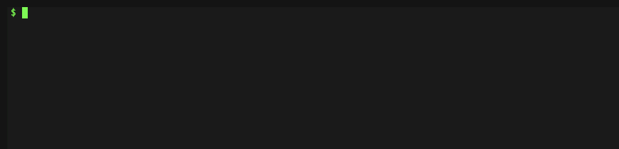

# eol.bar

[](https://github.com/rikuson/eol.bar/actions/workflows/node.js.yml)
[](https://github.com/rikuson/eol.bar/actions/workflows/curl.yml)


When your project depends on other product, you must care when to update those dependencies.  
**eol.bar** provides a schedule of end-of-life dates of various products graphically.  
Those data are powered by [endoflife.date](https://endoflife.date/) which is a community-maintained project.

## Basic Usage

Put `img` tag in your project's wiki or something.  
Alive lifecycles are shown as a default.

```html

```

[](https://eol.bar/nodejs.svg)

To list multiple products, separate by `+`.

```html

```

[](https://eol.bar/nodejs+php.svg)

## Advanced Usage

### Filtering

To filter lifecycles, put **comparison operator** after product name.  
Available operators: `=`, `>`, `>=`, `<`, `<=`.

NOTE: Right-hand side value of operation should be existing lifecycle.

```html

```

[](https://eol.bar/nodejs%3C=12.svg)

You can also use **wildcard** in a value.

```html

```

[](https://eol.bar/php=7.*.svg)

### Cropping

To adjust width, crop by url parameters: `from` / `to`.

```html

```

[](https://eol.bar/php=7.*.svg?from=2019-02-01&to=2021-11-30)

### Curl

**eol.bar** returns ascii graphically by curl request.

NOTE: Currently, *Cropping* is not supported by curl request.



Requesting root path shows help text.


## Development

### Fetch data

Fetch data from [endoflife.date](https://endoflife.date).

```bash
$ npm run prestart
$ NODE_ENV=development npm run fetch
```

### Start development server

Start web server with watching file change.  
NOTE: Execute this after fetching data.

```bash
$ npm run dev
```
